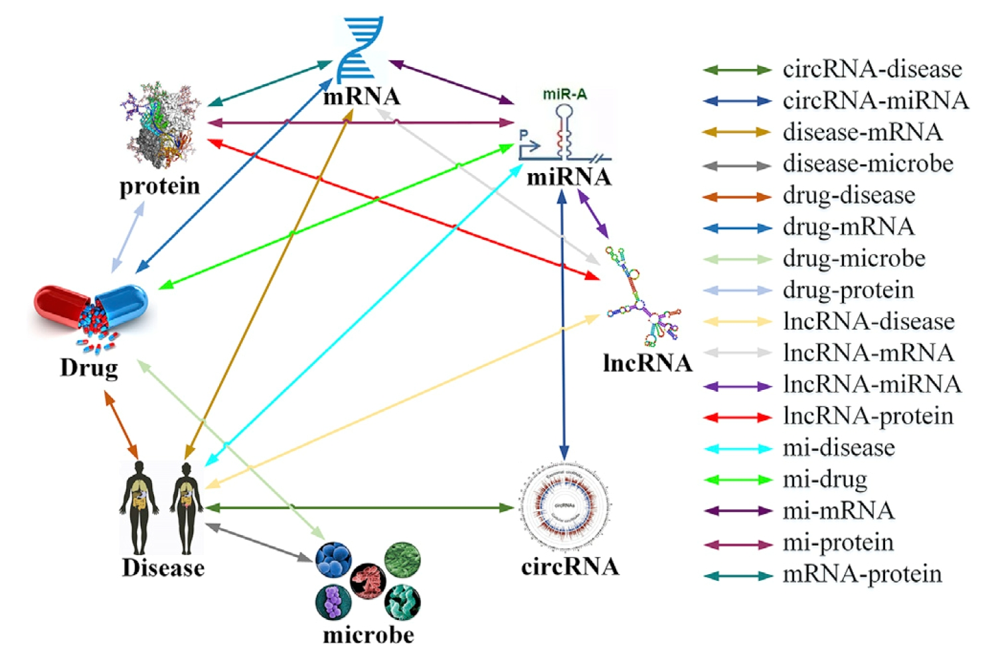
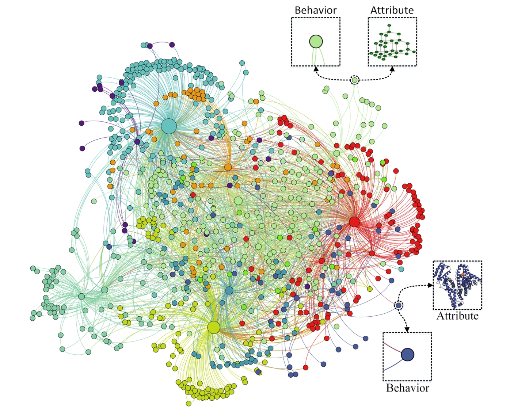

# stAggregator

## Overview
Background: 
The explosive growth of genomic, chemical, and pathological data provides new opportunities and challenges
for humans to thoroughly understand life activities in cells. However, there exist few computational models that 
aggregate various bioentities to comprehensively reveal the physical and functional landscape of biological systems. 

Results: We constructed a molecular association network, which contains 18 edges (relationships) between 8 nodes 
(bioentities). 

## Doc
The edges and nodes can be found in the above files.

## Reference:

If you find the data is useful for your research, please consider citing the following paper:

[3] Guo, Z. H., You, Z. H., Wang, Y. B., Huang, D. S., Yi, H. C., & Chen, Z. H. (2020). Bioentity2vec: Attribute-and 
behavior-driven representation for predicting multi-type relationships between bioentities. GigaScience, 9(6), giaa032. 
[2] Guo, Z. H., You, Z. H., Huang, D. S., Yi, H. C., Chen, Z. H., & Wang, Y. B. (2020). A learning based framework for 
diverse biomolecule relationship prediction in molecular association network. Communications biology, 3(1), 118.  
[1] Guo, Z. H., You, Z. H., & Yi, H. C. (2020). Integrative construction and analysis of molecular association network 
in human cells by fusing node attribute and behavior information. Molecular Therapy-Nucleic Acids, 19, 498-506. 
